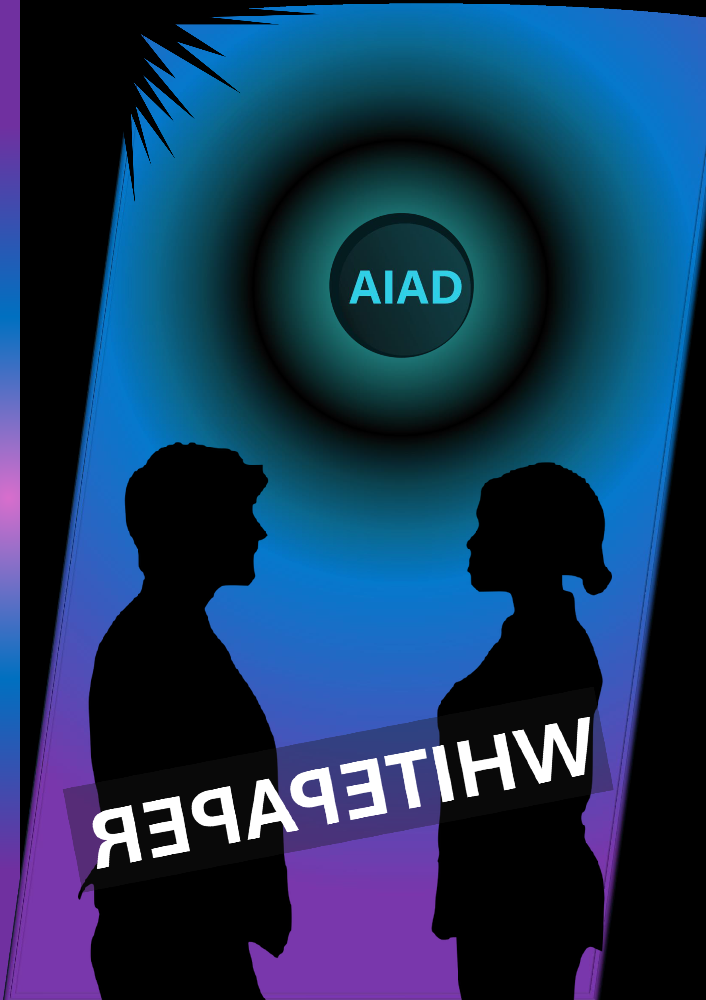
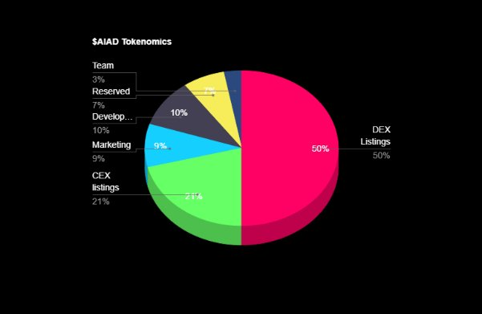

AIAD: Pioneering the Future of Digital Advertising
 

**AI-Powered Innovation on the Solana Blockchain**

AIAD is introducing a groundbreaking shift in the digital advertising realm with its AI-driven platform, built on the robust Solana blockchain. This pioneering approach is not just a technological advancement; it's a redefinition of advertising norms.

Revolutionizing Industry Standards

Enhanced Transparency

By utilizing blockchain, AIAD brings unparalleled transparency to digital advertising, allowing for a more honest and effective market environment.

Increased Efficiency

The speed and low cost of transactions on the Solana blockchain significantly boost the efficiency of ad placements and campaign management.

Engaging Users Like Never Before

User-Centric Engagement

AIAD leverages AI to create highly targeted and engaging ads, enhancing user experience and interaction.

Empowering with AIAD Tokens

The innovative use of AIAD tokens in this ecosystem not only streamlines transactions but also opens up new avenues for user participation and rewards.

A Vision Detailed in the Whitepaper

This whitepaper is more than just a document; it's a testament to AIAD's commitment to reshaping the industry. It details the intricate workings of AIAD's platform and its potential to transform digital advertising.

*AIAD is set to be a major player in the future of digital advertising, bringing innovative solutions to longstanding challenges in the industry.*

**1. Problem Statement**

**Digital Advertising Challenges and AIAD's Blockchain Solution**

Introduction to the Challenges

*The digital advertising sector is currently plagued with significant challenges that undermine its efficiency and effectiveness. Two of the most critical issues in this domain are click fraud and systemic inefficiencies.*

Click Fraud: A Pervasive Issue

Click fraud represents a major threat to the integrity of digital advertising. It involves the manipulation of pay-per-click advertising, where illegitimate or artificial clicks on ads lead to inflated advertising costs without corresponding benefits to the advertisers. This fraudulent activity not only skews analytics and marketing data but also drains financial resources, leading to mistrust and skepticism among advertisers.

Systemic Inefficiencies

Apart from click fraud, the sector grapples with various inefficiencies. These include lack of transparency in ad performance metrics, difficulties in tracking user engagement accurately, and the high overhead costs associated with intermediaries in the advertising ecosystem. Such inefficiencies reduce the overall ROI for advertisers and create barriers to effective and targeted advertising campaigns.

AIAD's Blockchain-Based Solution

AIAD proposes a transformative solution by leveraging the Solana blockchain. This approach is aimed at directly addressing these pervasive issues in the digital advertising sector.

Leveraging Solana for Transparency and Efficiency

Transparency: By utilizing the Solana blockchain, AIAD ensures that all ad metrics are recorded in a tamper-proof and transparent manner. This transparency is crucial in combating click fraud, as it allows for accurate tracking and verification of genuine user engagements with advertisements.

Efficiency

The Solana blockchain is known for its high throughput and low transaction costs, which makes it an ideal platform for handling the vast array of transactions typically involved in digital advertising. This efficiency translates to reduced overhead costs, faster processing of ad transactions, and more streamlined operations.

Enhanced Ad Targeting and User Engagement

With blockchain technology, AIAD can implement more effective ad targeting mechanisms. By accurately tracking user preferences and engagement, the platform can deliver more personalized and relevant ad content, thereby improving the overall effectiveness of advertising campaigns.

Reducing the Impact of Intermediaries

Blockchain technology allows for direct interactions between advertisers and publishers. This direct connection can significantly reduce the costs and complexities associated with intermediaries, leading to a more efficient advertising process.

What we can do

the digital advertising sector's challenges of click fraud and inefficiency are substantial but not insurmountable. AIAD's innovative use of the Solana blockchain offers a promising path forward. By harnessing the power of blockchain for transparency and efficiency, AIAD is poised to redefine the landscape of digital advertising, making it more trustworthy, cost-effective, and aligned with the actual needs of advertisers and users.

**1.2. AIAD's Solution: Reinventing Digital Advertising**

AIAD's Innovative Approach

AIAD's strategy to transform digital advertising hinges on a powerful combination of AI algorithms and the Solana blockchain's capabilities. This section delves into how AIAD's solution promises to revitalize the advertising industry.

Integration of AI Algorithms

Enhanced Targeting: AIAD employs advanced AI algorithms for precise ad targeting. By analyzing user behavior and preferences, AIAD can deliver highly relevant ads, leading to better engagement and satisfaction for users.

Fraud Reduction: The AI component is instrumental in detecting and mitigating fraudulent activities such as click fraud. By analyzing patterns and flagging anomalies, AIAD's AI algorithms play a critical role in ensuring the integrity and efficacy of advertising campaigns.

Leveraging Solana Blockchain

Efficiency and Low Cost

The choice of the Solana blockchain is pivotal to AIAD's approach. Known for its high throughput and low transaction fees, Solana enables AIAD to process large volumes of advertising transactions efficiently and cost-effectively.

Transparency and Security: Blockchain technology inherently offers transparency and security. With ad transactions and engagements recorded on the Solana blockchain, AIAD ensures a transparent, verifiable, and secure advertising ecosystem.

Resulting Benefits

Greater ROI for Advertisers

The combination of AI-driven targeting and blockchain efficiency leads to a higher Return on Investment (ROI) for advertisers. With more effective ad placements and reduced instances of fraud, advertisers can expect better outcomes for their spending.

Streamlining the Advertising Process: AIAD's approach streamlines the entire advertising process, from ad placement to performance tracking. This efficiency not only benefits advertisers but also enhances the overall health of the digital advertising ecosystem.

*AIAD's solution, with its innovative use of AI and blockchain technology, is poised to address the long-standing challenges in digital advertising. By offering enhanced targeting, reduced fraud, and greater efficiency, AIAD stands as a transformative force in the industry, heralding a new era of effective and transparent digital advertising.*

**2. Core Components**
 

 

2\.1. Solana-based Ad Exchange

Revolutionizing Ad Exchange with Solana

AIAD's ad exchange platform, now powered by the Solana blockchain, is a significant innovation in digital advertising. This section explores how this integration transforms the interaction between advertisers and publishers.

Direct Connection Between Advertisers and Publishers

Eliminating Intermediaries: By connecting advertisers and publishers directly, AIAD's platform on Solana removes the need for intermediaries. This change significantly cuts down on the traditional costs associated with ad placements.

Enhanced Trust and Transparency

The direct connection fosters a more transparent relationship between advertisers and publishers, ensuring that both parties can trust the process and the outcomes.

Leveraging Solana's High-Speed and Low-Cost Advantage

Increased Transaction Speed

Solana's blockchain is renowned for its high-speed transaction capabilities. This feature allows AIAD's ad exchange to operate with unprecedented efficiency, handling large volumes of transactions swiftly.

Reduced Operational Costs

The low transaction fees associated with Solana significantly reduce the costs of ad exchanges. This reduction is beneficial for both advertisers and publishers, allowing for more budget-friendly and efficient advertising campaigns.

Optimizing Advertising Efficacy

Real-Time Processing

The rapid processing capabilities of the Solana blockchain enable real-time updating and management of advertising campaigns. This immediacy allows advertisers to adapt quickly to market changes or audience responses.

Broadening Access

The efficiency and reduced cost structure of AIAD's Solana-based ad exchange open up opportunities for a broader range of advertisers, including smaller businesses or niche markets that previously found the cost of digital advertising prohibitive.

*AIAD's Solana-based ad exchange is a pivotal development in digital advertising. It brings a new level of efficiency, cost-effectiveness, and direct engagement between advertisers and publishers. This innovation is set to redefine the advertising landscape, making it more accessible, transparent, and responsive to the dynamic needs of the market.*

**2.2. AI-Driven Targeting and Privacy**

Balancing Precision and Privacy in Digital Advertising

AIAD's platform integrates advanced AI algorithms for ad targeting, ensuring a balance between precision in advertising and user privacy. This section elaborates on how AIAD achieves this equilibrium.

Sophisticated AI Algorithms for Targeting

Personalization: AIAD's AI algorithms are designed to analyze user behavior and preferences subtly and efficiently. This analysis enables highly personalized ad targeting, ensuring that users are presented with ads that are relevant and engaging.

Continuous Learning and Improvement

The AI system continually learns from user interactions, refining its targeting strategies. This adaptability ensures that the advertising remains effective and relevant over time.

User Data Security: Privacy at the Forefront

AIAD prioritizes user privacy. Utilizing blockchain technology, the platform secures user data, ensuring that personal information is kept confidential and protected from unauthorized access.

Consent-Based Data Usage

AIAD adopts a consent-based approach for data usage. Users have control over their data and can choose how much information they wish to share, fostering a trust-based relationship between the platform and its users.

Blockchain's Role in Enhancing Security

Decentralized Data Management: By leveraging the decentralized nature of blockchain, AIAD ensures that user data is not centralized in a single location, reducing the risk of data breaches and misuse.

Transparency in Data Handling

The blockchain's transparent nature allows users to see how their data is being used. This transparency is crucial in building trust and ensuring accountability in ad targeting practices.

*AIAD's approach to ad targeting represents a significant advancement in digital advertising. By combining sophisticated AI algorithms with the robust security features of blockchain technology, AIAD successfully balances effective ad targeting with the utmost respect for user privacy. This innovative approach not only enhances the effectiveness of digital advertising but also sets a new standard in responsible data handling and user-centric advertising practices.*

**2.3. Transparent Metrics on Solana**

Revolutionizing Ad Metrics with Blockchain Technology

AIAD's use of the Solana blockchain brings a new level of transparency and security to advertising metrics.

Robust and Transparent Tracking

Transparency in Ad Performance: By leveraging Solana's blockchain, AIAD ensures that all advertising metrics are transparent. Advertisers can view real-time data on ad performance, giving them a clear and honest picture of their campaigns' effectiveness.

Tamper-Proof Records

The immutable nature of blockchain technology means that once ad performance data is recorded on the Solana blockchain, it cannot be altered. This feature is crucial in preventing manipulation of metrics and combating fraud, such as click fraud.

Real-Time Data Access

Immediate Insights

AIAD's platform allows for real-time access to ad metrics, enabling advertisers to make quick, informed decisions based on current data. This immediacy is vital in the fast-paced world of digital advertising, where timely information can significantly impact campaign success.

Enhancing Trust in Digital Advertising

Building Confidence: The combination of transparency and security in ad metrics builds confidence among advertisers. Knowing that they can rely on accurate and untampered data, advertisers can trust the AIAD platform for their digital marketing needs.

**

**2.4. Tokenomics of AIAD**

Strategic Distribution of AIAD Tokens

AIAD's tokenomics strategy is designed to ensure the long-term viability and growth of the platform. The distribution of AIAD tokens is as follows:

DEX Listing (50%)

A significant portion allocated for decentralized exchange listings. This strategy is key for ensuring widespread availability and accessibility of the AIAD token, facilitating easy trading and liquidity for users.

CEX Listing (21%)

Centralized exchange listings are crucial for reaching a broader market, providing more traditional and often more user-friendly trading options for a wider range of investors.

Team (3%)

This modest allocation for the team showcases a commitment to the project's future, ensuring that those who are developing and maintaining the platform are invested in its success.

Marketing (9%)

Dedicated funds for marketing are vital for platform awareness and user adoption. This allocation reflects the importance of promoting AIAD and attracting users and advertisers to the ecosystem.

Development (10%)

Investment in ongoing development is critical for the platform's scalability, security, and the introduction of new features. This ensures the platform remains competitive and relevant.

Reserved (7%)

Reserved tokens can serve multiple purposes, such as contingency funds, future strategic investments, or other unforeseen necessities, offering flexibility in the platform's financial planning.

Implications and Benefits

Healthy Circulation

With a significant percentage of tokens allocated for exchange listings, AIAD ensures a healthy circulation in the market. This accessibility encourages trading and liquidity, which is essential for the token's value and utility.

Balanced Approach

The balanced distribution between development, team, and marketing ensures a well-rounded approach to growing the platform. It aligns the interests of developers, users, and investors towards the common goal of platform success.

Long-term Growth: By reserving a portion of the tokens, AIAD positions itself for sustainable growth. This foresight allows for strategic maneuvers in response to market trends and technological advancements.

**2.5. AIAD Roadmap**

Q1 2024 à Token Launch

Official launch of AIAD tokens, marking the beginning of public trading and investment opportunities.

Beta Version Development: Initiation of the beta version of the AIAD platform, focusing on core functionalities and user experience.

Q2 2024 à Beta Version Testing and Feedback

Implementation of beta testing with a select group of users to gather feedback and data for refinement.

Strategic Partnerships: Forming strategic partnerships with key players in the digital advertising and blockchain sectors.

Q3 2024 - Q1 2025 à Platform Optimization

Incorporating feedback from the beta version to optimize the platform for wider release.

Enhanced AI Algorithm Integration: Further development and integration of advanced AI algorithms for ad targeting and privacy protection.

Q2 2025 à Full Platform Launch

Official launch of the complete AIAD platform with all features operational.

Marketing and User Acquisition Campaigns: Aggressive marketing efforts to attract advertisers, publishers, and users to the platform.

Q3 2025 à Expansion of Services

Introduction of additional services and features, based on market demands and technological advancements.

*Community Building Initiatives*

*Focused efforts on building a robust AIAD user and investor community.*

Q4 2025 à Assessment and Future Roadmapping

Comprehensive assessment of the platform's performance and outlining future roadmap beyond 2025.

**2.6. Expertise and Vision**

The Driving Force Behind AIAD

The AIAD team and advisory board are composed of seasoned professionals and experts in blockchain technology, artificial intelligence, and digital advertising. This section highlights their collective expertise, roles, and contributions to AIAD's vision and execution.

Diverse Expertise for a Comprehensive Approach

Blockchain Experts: Team members specializing in blockchain technology provide the technical foundation for AIAD. Their expertise ensures the platform is secure, efficient, and scalable.

AI Innovators

AI specialists bring cutting-edge algorithmic knowledge, essential for developing the advanced ad targeting and privacy protection features of AIAD.

Digital Advertising Veterans

Professionals with a background in digital advertising offer insights into market trends, user behavior, and effective advertising strategies.

**2.7. Role in AIAD's Development**

Strategic Vision and Planning

The combined expertise of the team shapes AIAD's strategic vision. They are instrumental in planning the platform's development, ensuring it meets industry needs and stays ahead of technological trends.

Guidance and Oversight

Advisors play a crucial role in offering guidance and oversight. Their diverse backgrounds and experiences provide a well-rounded perspective, crucial for navigating the complexities of the digital advertising and blockchain sectors.

**3.1. Commitment to AIAD's Success**

Innovation and Adaptability

Team members are committed to innovation, constantly seeking ways to improve the platform. Their adaptability allows AIAD to evolve with the changing digital landscape.

Execution and Implementation

The team's skills are not just theoretical; they are deeply involved in the practical execution and implementation of AIAD's roadmap, ensuring that plans translate into tangible results.

Market Analysis

Digital Advertising Landscape and Blockchain Integration

AIAD's market analysis comprehensively examines the current state and future trends of digital advertising, with a focus on the growing role of blockchain technology.

**3.2. Current Landscape of Digital Advertising**

Market Size and Growth

The section begins by exploring the current size and projected growth of the digital advertising market, highlighting key areas such as mobile advertising, social media marketing, and programmatic ad buying.

Challenges and Pain Points

It delves into the prevalent challenges within the industry, including issues related to ad fraud, transparency, data privacy, and the inefficiency of traditional advertising models.

Blockchain as a Transformative Solution

Addressing Industry Challenges

The analysis details how blockchain technology offers solutions to many of the existing challenges in digital advertising, particularly in enhancing transparency, reducing fraud, and improving data management.

Case Studies and Examples

The inclusion of case studies or real-world examples where blockchain has been effectively implemented in advertising adds practical insights into this analysis.

AIAD's Position in the Market

Unique Value Proposition

This section emphasizes AIAD's unique value proposition, outlining how its specific use of blockchain and AI sets it apart in the market.

Competitive Landscape

A review of the competitive landscape, assessing how AIAD stacks up against existing and emerging solutions in digital advertising and blockchain integration.

Future Trends and Opportunities

Emerging Technologies

Exploration of how emerging technologies like AI, machine learning, and advanced data analytics are shaping the future of digital advertising.

AIAD's Adaptability and Future Plans

The section concludes with AIAD's vision for adapting to these trends and capitalizing on future market opportunities, positioning AIAD as a forward-thinking leader in this transformation.

**3.4. Legal and Regulatory Compliance in AIAD's Ecosystem**

*AIAD's commitment to legal and regulatory compliance is fundamental to its operations, particularly concerning data privacy and token utility.*

Adherence to Data Privacy Laws

Global Standards: AIAD ensures compliance with global data privacy regulations like GDPR, emphasizing the protection of user data and privacy.

User Consent and Transparency

The platform adheres to strict guidelines for user consent, ensuring transparency in data collection and usage.

Token Utility Compliance

Regulatory Framework for Tokens: AIAD navigates the complex regulatory environment surrounding cryptocurrencies, ensuring that its token utility aligns with legal standards in various jurisdictions.

Anti-Money Laundering and KYC

The platform incorporates robust Anti-Money Laundering (AML) and Know Your Customer (KYC) protocols to prevent misuse of its tokens.

Proactive Legal Strategy

Continuous Legal Monitoring

AIAD maintains an ongoing process of legal monitoring and compliance updating, adapting to evolving regulations in the blockchain and digital advertising spaces.

Legal Advisory Team

A dedicated legal advisory team ensures that AIAD's operations remain within legal bounds, safeguarding the platform against potential legal challenges.

**AIAD: Shaping the Future of Digital Advertising**

*AIAD is not just a participant in the digital advertising revolution; it is a trailblazer, setting new standards and redefining the ecosystem.*

*The unique amalgamation of blockchain technology and AI at the heart of AIAD is driving this transformation. By prioritizing transparency, efficiency, and user engagement, AIAD is crafting an environment where advertisers, publishers, and users all reap substantial benefits.*

*The impact of this evolution extends beyond mere technological advancement; it heralds a shift towards a more equitable, effective, and trust-based digital advertising world. As AIAD continues to innovate and evolve, it is poised to not only adapt to the future of advertising but to actively shape it.*

